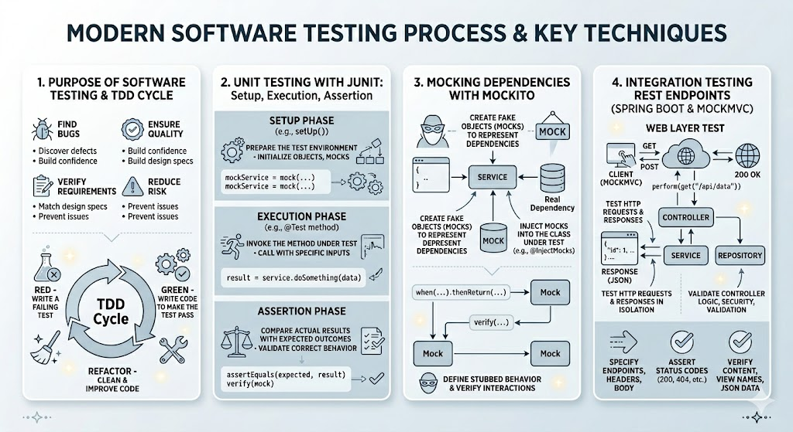

# [3.19] Software Testing: Unit and Integration Testing

## Lesson Overview

## Dependencies

- [Self Studies](./studies.md) / [Lesson](./lesson.md) / [Assignment](./assignment.md) / [Slide Deck](./slides.md)

## Lesson Objectives

By the end of this lesson, students will be able to:

* **Explain** the purpose of software testing and the TDD cycle
* **Write** unit tests using JUnit with setup, execution, and assertion phases
* **Mock** dependencies using Mockito to test the service layer in isolation
* **Perform** integration testing of REST endpoints using Spring Boot and MockMvc

## Lesson Plan

| Duration | What | How or Why |
|---|---|---|
| 10 min | Warm-up | Recap service and repository layers from Lesson 3.14 — students will be writing tests for these exact layers today |
| 15 min | Part 1: Introduction to Software Testing | Overview of testing types and why automated testing matters — focus on Unit and Integration Testing as the lesson's scope |
| 15 min | Part 2: TDD — Red, Green, Refactor | Explain the TDD cycle with a practical example from `simple-crm`; discuss trade-offs of TDD vs hybrid approach |
| 20 min | Part 3: Unit Testing with JUnit | Code-along — create `DemoService` and `DemoServiceTest`; introduce `@Test`, Arrange-Act-Assert, assertion methods, lifecycle annotations |
| 10 min | Activity — Add 3 methods + tests to DemoService | Students independently add `multiply`, `divide`, `isEven` and write tests for each |
| 10 min | Break | — |
| 25 min | Part 4: Service Layer Unit Testing with Mockito | Code-along — create `CustomerServiceImplTest`; introduce `@Mock`, `@InjectMocks`, `when().thenReturn()`, `verify()`; test `createCustomer`, `getCustomer`, and `getCustomerNotFound` |
| 35 min | Part 5: Integration Testing with MockMvc | Code-along — create `CustomerControllerTest`; introduce `@SpringBootTest`, `@AutoConfigureMockMvc`, `MockMvc`, `ObjectMapper`, and JsonPath; test GET, GET all, valid POST, and invalid POST |
| 10 min | Wrap-up | Recap unit vs integration testing, Mockito mocking, MockMvc request building, and how automated tests support safe refactoring |
| **150 min** | **Total** | |